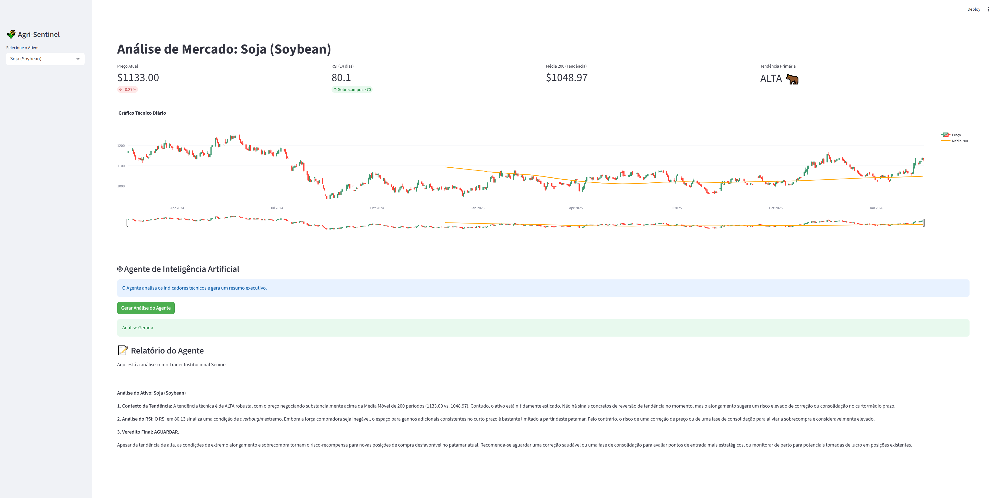

# 🌾 Agri-Trend Sentinel

> **Painel de Inteligência Artificial para Monitoramento de Commodities Agrícolas.**

[](LINK_DO_SEU_DEPLOY_AQUI)

## 📸 Demo em Funcionamento


## 💡 O que este projeto faz?
Este sistema resolve o problema do **excesso de ruído** no mercado agrícola.
Em vez de apenas mostrar gráficos, ele utiliza um **Agente de IA Autônomo (Google Gemini)** para ler os indicadores técnicos (RSI, Médias Móveis) e escrever um relatório executivo em tempo real, recomendando Compra, Venda ou Espera.

## 🤖 Diferenciais Técnicos
* **Full Stack Data Science:** Do ETL dos dados brutos até o Frontend interativo.
* **IA Generativa Integrada:** O sistema não usa frases prontas; ele "raciocina" sobre os dados numéricos usando LLMs.
* **Automação:** Inclui um robô (`robo_alerta.py`) que roda em background varrendo o mercado em busca de oportunidades.

## 🛠️ Tech Stack


---
### ⚙️ Como rodar localmente (Para Desenvolvedores)
*(Aqui você deixa aquelas instruções técnicas que eu mandei antes, mas lá no rodapé)*
...

## ⚙️ Como Rodar Localmente

1.  **Clone o repositório:**
    ```bash
    git clone [https://github.com/SEU-USUARIO/agri-trend-sentinel.git](https://github.com/SEU-USUARIO/agri-trend-sentinel.git)
    cd agri-trend-sentinel
    ```

2.  **Instale as dependências:**
    ```bash
    pip install -r requirements.txt
    ```

3.  **Configure a API Key do Google Gemini:**
    * Crie uma pasta `.streamlit` na raiz do projeto.
    * Crie um arquivo `secrets.toml` dentro dela.
    * Adicione sua chave: `GEMINI_API_KEY = "SUA_CHAVE_AQUI"`

4.  **Execute o Dashboard:**
    ```bash
    streamlit run app.py
    ```

5.  **Execute o Robô de Alertas:**
    ```bash
    python robo_alerta.py
    ```

## 📊 Funcionalidades (v1.0)
- [x] Seleção de Commodities (Soja, Milho, Café, Boi Gordo, Ouro).
- [x] Gráficos de Candle com Médias Móveis (SMA 50/200).
- [x] Cálculo automático de RSI (Índice de Força Relativa).
- [x] **Agente de IA:** Gera análises de compra/venda em linguagem natural.
- [x] **Screener Automático:** Filtra ativos com setup técnico e gera e-mails de alerta.

---
**Status:** ✅ Concluído (v1.0)
**Autor:** [Filiphe Assunção]
